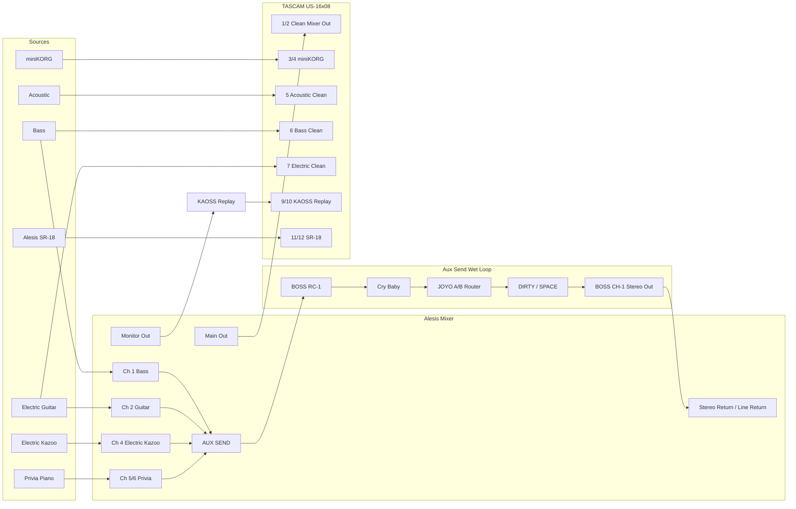

# Music Rig

Living documentation for a one-human, many-machines home studio routing system: Alesis mixer, TASCAM US-16x08, Ableton Live, KAOSS Replay, BOSS RC-1, miniKORG, Privia, SR-18, pedal loops, patchbays, DI/reamp utilities, MIDI sync, and troubleshooting notes.

Documentation site: https://sempervent.github.io/music-rig/

This repo is intended to be the authoritative source for:

- current signal flow
- channel maps
- patchbay jack maps
- pedal-chain inventory vs active topology
- accepted TODO work vs speculative wishlist
- MIDI clock strategy
- Ableton track naming
- troubleshooting history
- planned upgrades and experiments (wishlist only until accepted into TODO)

## Current high-level architecture



Clean paths use preamp → A/B/Y before the confirmed TASCAM clean legs (5/6/7). AUX SEND order is RC-1 → Cry Baby → JOYO. Patchbay detail: [docs/patchbays.md](docs/patchbays.md).

## Docs

- [Current routing](docs/current-routing.md)
- [Inventory](docs/inventory.md)
- [Patchbays](docs/patchbays.md)
- [Todo](docs/todo.md) — accepted work only
- [Wishlist](docs/wishlist.md) — speculative / evaluative, not commitments
- [TASCAM channel map](docs/tascam-channel-map.md)
- [Alesis mixer map](docs/alesis-mixer-map.md)
- [Pedal chains](docs/pedal-chains.md)
- [Ableton track map](docs/ableton-track-map.md)
- [MIDI clock and controller notes](docs/midi-clock.md)
- [Reamp and DI notes](docs/reamp-and-di.md)
- [Troubleshooting log](docs/troubleshooting.md)
- [Open questions](docs/open-questions.md) — unresolved facts

## Documentation CI/CD

- Pull requests that change documentation-related files run `mkdocs build --strict`.
- Pushes to `main` and manual workflow runs build the site and deploy it to GitHub Pages.
- Local validation:

```bash
python -m pip install -r requirements-docs.txt
mkdocs build --strict
```

- Local preview:

```bash
mkdocs serve
```

## Local docs preview

This repo is MkDocs-ready:

```bash
python -m pip install -r requirements-docs.txt
mkdocs serve
```
