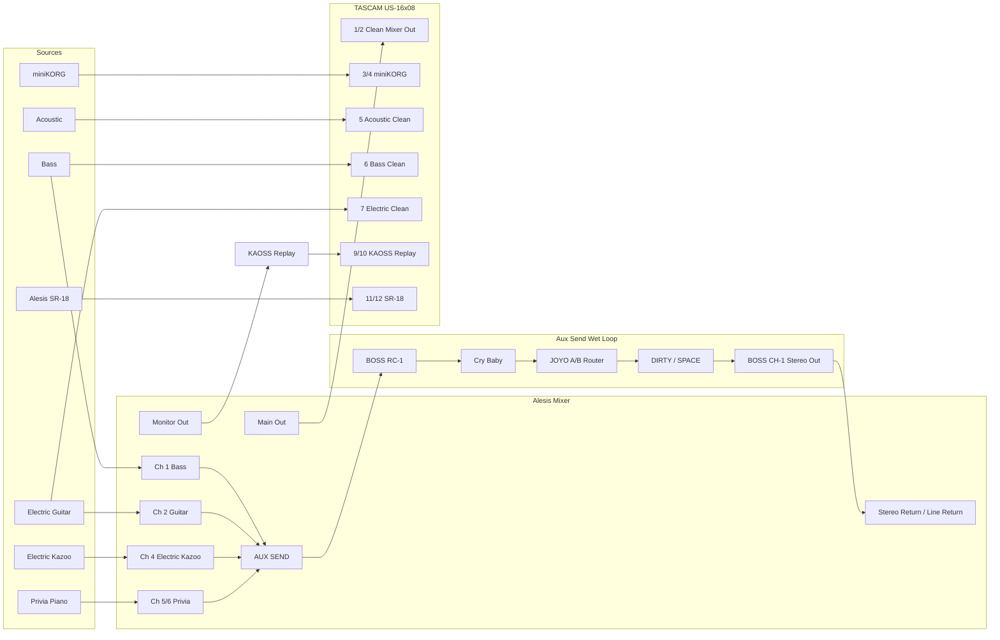

# Music Rig

Living documentation for a one-human, many-machines home studio routing system: Alesis mixer, TASCAM US-16x08, Ableton Live, KAOSS Replay, BOSS RC-1, miniKORG, Privia, SR-18, pedal loops, patchbays, DI/reamp utilities, MIDI sync, and troubleshooting notes.

Documentation site: https://sempervent.github.io/music-rig/

This repo is intended to be the authoritative source for:

- current signal flow
- channel maps
- patchbay jack maps
- pedal-chain inventory vs active topology
- accepted TODO work vs speculative wishlist
- MIDI clock strategy
- Ableton track naming
- troubleshooting history
- planned upgrades and experiments (wishlist only until accepted into TODO)

## Current high-level architecture



Clean paths use preamp → A/B/Y before the confirmed TASCAM clean legs (5/6/7). AUX SEND order is RC-1 → Cry Baby → JOYO. Patchbay detail: [docs/patchbays.md](docs/patchbays.md).

## Docs

- [Current routing](docs/current-routing.md)
- [Inventory](docs/inventory.md)
- [Patchbays](docs/patchbays.md)
- [Todo](docs/todo.md) — accepted work only (canonical: `data/todo.yaml`)
- [Wishlist](docs/wishlist.md) — speculative / evaluative, not commitments (canonical: `data/wishlist.yaml`)
- [TASCAM channel map](docs/tascam-channel-map.md)
- [Alesis mixer map](docs/alesis-mixer-map.md)
- [Pedal chains](docs/pedal-chains.md)
- [Ableton track map](docs/ableton-track-map.md)
- [MIDI clock and controller notes](docs/midi-clock.md)
- [Reamp and DI notes](docs/reamp-and-di.md)
- [Troubleshooting log](docs/troubleshooting.md)
- [Open questions](docs/open-questions.md) — unresolved facts

## Planning CLI (`rig`)

Canonical planning and studio-ops data:

```text
data/todo.yaml            = canonical TODO data
data/wishlist.yaml        = canonical wishlist data
data/inbox.yaml           = uncategorized capture inbox
data/changes.yaml         = physical/logical change captures (not auto-CURRENT)
data/open-questions.yaml  = unresolved factual questions (canonical)
data/sessions/            = studio session logs (one YAML file per session)
docs/todo.md              = human-facing rendered representation
docs/wishlist.md          = human-facing rendered representation
docs/open-questions.md    = human-facing questions (generated section)
```

Do not manually edit the generated marker sections in the Markdown files.
Inbox captures, session discoveries, OPEN changes, and OPEN questions are not CURRENT routing truth until reconciled into docs/data.

```bash
uv sync --extra dev --extra docs
uv run rig --help
uv run rig status

# What should I do?
uv run rig now
uv run rig now --play

# Unknown facts
uv run rig question list
uv run rig question show Q-008
uv run rig question resolve Q-008
uv run rig question todo Q-008

# What still needs reconciliation?
uv run rig reconcile
uv run rig reconcile change CHG-001
uv run rig reconcile question Q-008

# Begin working
uv run rig session start
uv run rig session status

# See current wiring
uv run rig channels
uv run rig patchbay list
uv run rig patchbay PB-B
uv run rig path list
uv run rig path show space

# Evidence vs CURRENT truth
# I noticed something:        rig capture / rig change
# I verified CURRENT truth:   rig current ...
# What is unresolved:         rig reconcile
# Maintenance advice:         rig doctor

# Verify PB-B physically (transactional)
uv run rig current patchbay verify PB-B

# Record one exact mode (preview first)
uv run rig current patchbay set-mode PB-B 1 half-normal --dry-run
uv run rig current patchbay set-mode PB-B 1 half-normal --question Q-008

# Channel source assignment
uv run rig current channels set-source tascam 8 "Spare DI"
uv run rig current channels clear-source tascam 8

# CURRENT routing / pedal topology
uv run rig path show space
uv run rig current path branches space
uv run rig current path verify space
uv run rig current path move space TR-2 --branch sy1-send --after PH-3 --dry-run
uv run rig current path move space TR-2 --branch sy1-send --after PH-3
uv run rig change "TR-2 may have moved" --category PEDAL_CHAIN

# While working
uv run rig session note "PH-3 confirmed before TR-2"
uv run rig session discovery "RE-2 quiet on separate power"
uv run rig session capture "Maybe try Privia into miniKORG"

# Physical rig changed
uv run rig change "Moved pedal X after pedal Y" --category PEDAL_CHAIN
uv run rig changes list

# End
uv run rig session end

# Maintenance overview
uv run rig doctor

uv run rig todo list
uv run rig wish list
uv run rig capture "Something weird happened"

uv run rig render
uv run rig render --check
uv run rig check
```

Mutation commands write YAML and re-render Markdown unless `--no-render` is passed.
`rig change` / `rig question resolve` record evidence; they do not rewrite CURRENT routing.
`rig current …` modifies authoritative CURRENT state (typed, previewed, confirm by default).
`rig now` is deterministic and explainable (no LLM).
`rig doctor` is advisory; `rig check` remains the CI gate.
No CLI command commits or pushes Git.

## Documentation CI/CD

- CI runs pytest, `rig check`, `rig render --check`, channel-map print, and `mkdocs build --strict`.
- Pushes to `main` also deploy the MkDocs site to GitHub Pages.
- Local validation:

```bash
uv sync --locked --extra dev --extra docs
uv run pytest
uv run rig check
uv run rig render --check
uv run python scripts/print_channel_map.py
uv run mkdocs build --strict
```

- Local preview:

```bash
uv run mkdocs serve
```
